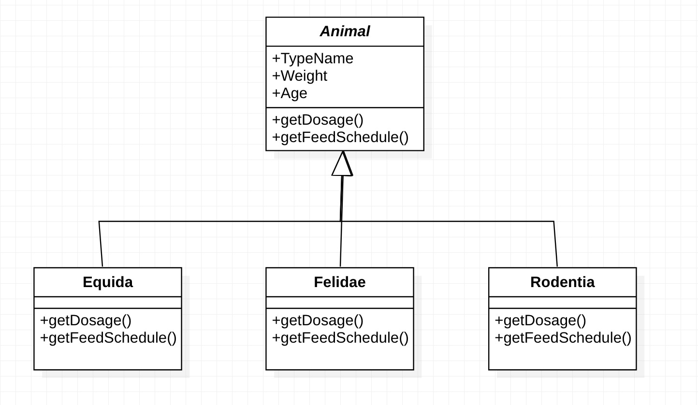

# Hayvanat Bahçesi
Patika.dev Polimorfizm Ödevi

- **Animal**: Abstract Class
-- **Equida** *(Animal sınıfnı miras alır)*. (atlar, zebralar, eşekler vb.),
-- **Felidae** *(Animal sınıfnı miras alır)*(kaplanlar, aslanlar vb.),
-- **Rodentia** *(Animal sınıfnı miras alır)* (sıçanlar, kunduzlar vb.)

Her hayvanın belirli ilaçların dozajını alabilmeli => **getDosage()**

Sistem Yem verme zamanlarını hesaplayabilmelidir => **getFeedSchedule ()**