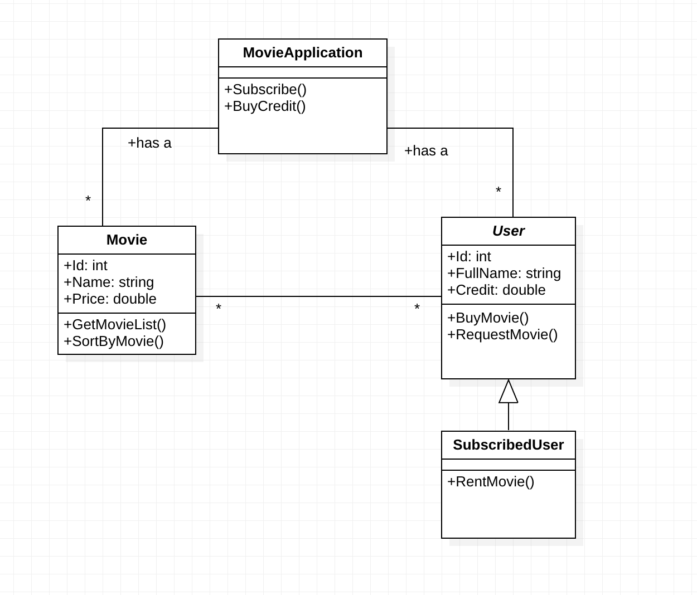

# Online Film Sitesi
Patika.dev OOP Ödevi

###Online film satan veya kiralayan uygulamanın sistemini tasarlayın.

- Uygulamada filmler listenebilir, sıralanabilir ve kullanıcılar uygulamaya abone olabilir.
- Kullanıcılar abonelik için sistem üzerinden kredi satın alır.
- Sadece abone olan kullanıcılar, kredileri ile film kiralayabilir ve kiraladığı filmin kredi bedeli kadar hesabından düşülür.
- Normal kullanıcılar ve aboneler film satın alabilirler.
- Eğer film mevcut değilse ise talep edilebilir.